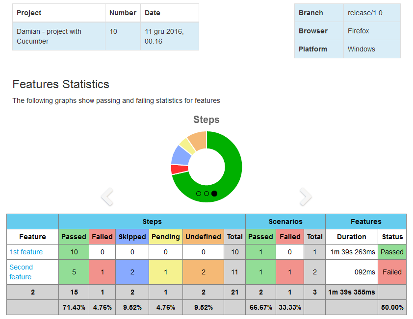
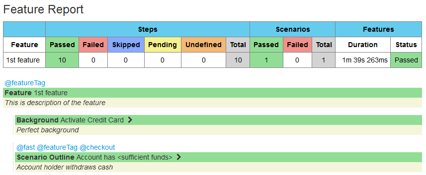
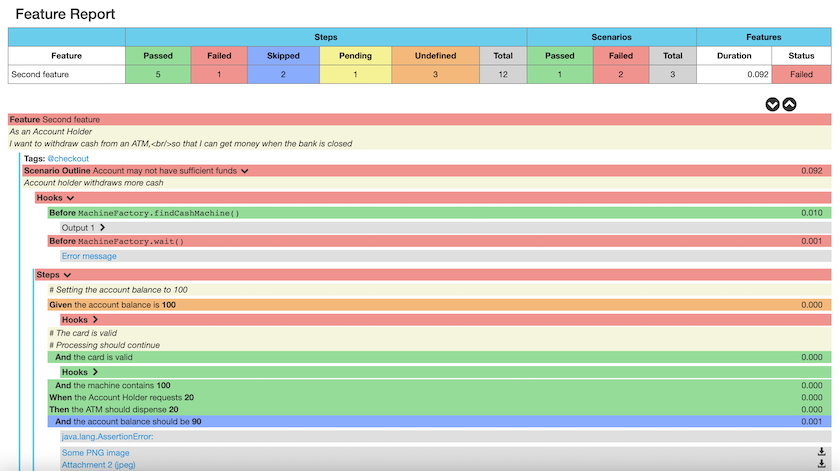
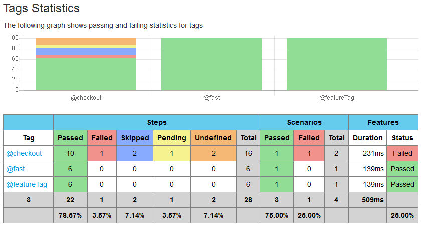
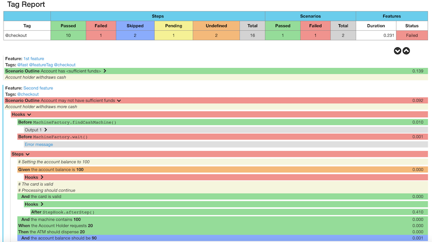
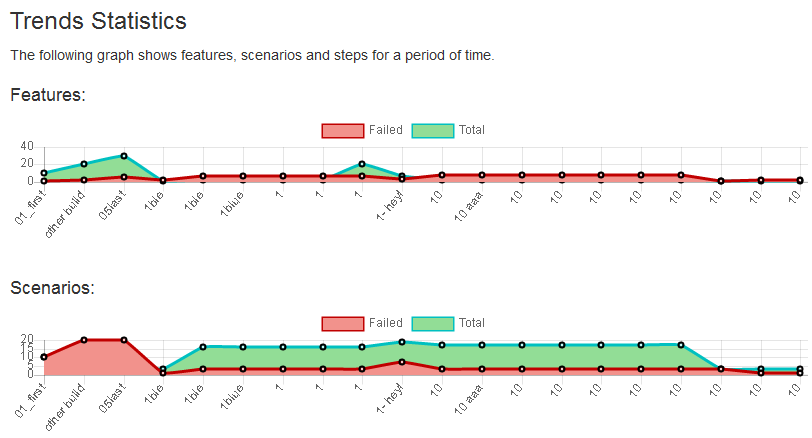

[](https://github.com/som30ind/node-cucumber-reporting/actions/workflows/npm-publish.yml)
[](https://github.com/som30ind/node-cucumber-reporting/actions/workflows/build-demo.yml)
[](https://som30ind.github.io/cucumber-report-html/overview-features.html)
[](https://github.com/som30ind/node-cucumber-reporting/actions/workflows/codecov.yml)
[](https://snyk.io/org/som30ind/project/187055d6-fe31-4c65-98c2-c53ffc3e3293)
[](https://github.com/som30ind/node-cucumber-reporting/actions/workflows/github-code-scanning/codeql)
[](https://raw.githubusercontent.com/som30ind/node-cucumber-reporting/master/LICENSE)
[](https://github.com/som30ind/node-cucumber-reporting/graphs/contributors)

# Node.js Cucumber Reporting

This is a Node.js report publisher primarily created to publish [cucumber](https://cucumber.io/) reports on the Jenkins build server.
It publishes pretty html reports with charts showing the results of [cucumber](https://cucumber.io/) runs. It has been split out into a standalone package so it can be used for Jenkins and Node.js command line as well as any other packaging that might be useful. Generated report has no dependency so can be viewed offline. This package is inspired from the [Maven Cucumber Reporting Project](https://github.com/som30ind/node-cucumber-reporting).

## Background

Cucumber is a test automation tool following the principles of Behavioural Driven Design and living documentation. Specifications are written in a concise human readable form and executed in continuous integration.

This project allows you to publish the results of a [cucumber](https://cucumber.io/) run as pretty html reports. In order for this to work you must generate a [cucumber](https://cucumber.io/) json report. The project converts the json report into an overview html linking to separate feature files with stats and results.

## Install
Install NPM dependency
```sh
npm i @som30ind/cucumber-reporting --save
```

## Usage
```js
/**
 * Supports CJS require or ES6 Import.
 * const { ReportBuilder } = require('@som30ind/cucumber-reporting');
 * 
 * ES6 / TypeScript Import Statement is shown below
 */
import { ReportBuilder } from '@som30ind/cucumber-reporting';

/**
 * @param jsonFiles {string[]} (Mandetory) Array of Cucumber JSON Files.
 * It can be absolute or relative (from Project Root) path to the file.
 * Supports Glob Expression (https://mincong.io/2019/04/16/glob-expression-understanding/)
 * @param options {UserConfiguration} (Optional) Details for each option given below in the example.
 * All the configurations are also optional.
 * 
 * @example
 */
const reportBuilder = new ReportBuilder([
  './cucumber-reports/sample.json',
  './cucumber-reports/simple.json',
  './cucumber-reports/timestamped/**/*.json',
], {
  /**
   * Absolute or Relative (from Project Root) path to the directory where you want the reports to be generated.
   * 
   * @param reportDir {string}
   */
  reportDir: 'cucumber-report-html',
  /**
   * Name of the Project to be dislayed on the Report.
   * 
   * @param projectName {string}
   */
  projectName: `Somnath's Project`,
  /**
   * Build Number to be displayed on the report.
   * 
   * @param buildNumber {string}
   */
  buildNumber: '1',
  /**
   * These options are use to undertsand how the reports will be presented. Below are the options
   * 
   * RUN_WITH_JENKINS: Defines additional menu buttons that enables integration with Jenkins.
   * EXPAND_ALL_STEPS: Expands all scenarios by default.
   * PARALLEL_TESTING: Add "target" column to the report, when running the same tests many times.
   * Value of this column is same as JSON report file name.
   * 
   * @param presentationModes {string}
   */
  presentationModes: [
    'PARALLEL_TESTING',
  ],
  /**
   * Not failing statusses
   * Any valid Status from: SKIPPED | AMBIGUOUS | FAILED | PASSED | PENDING | UNDEFINED
   * 
   * @param notFailingStatuses {Status[]}
   */
  notFailingStatuses: [
    'SKIPPED',
  ],
  /**
   * Metadata that will be displayed at the main page of the report. It is useful when there is a few reports are
   * generated at the same time but with different parameters/configurations.
   * 
   * @param classifications {Record<string, string>} Key-Value-Pair of string.
   */
  classifications: {
    'Platform': 'Windows',
    'Browser': 'Firefox',
    'Branch': 'release/1.0',
  },
  /**
   * JSON files which house classifications in key value pairings. When these JSON files get
   * processed these classifications get displayed on the main page of the report as metadata in the order in which
   * they appear within the file.
   * It can be absolute or relative (from Project Root) path to the file.
   * Supports Glob Expression (https://mincong.io/2019/04/16/glob-expression-understanding/)
   * 
   * @param classificationFiles {string[]}
   */
  classificationFiles: [
    './resources/classifications/sample_one.json',
    './resources/classifications/sample_two.json'
  ],
  /**
   * Explicit qualifier to use for the given json file.
   * Key: JSON file name - without the extension
   * Value: Qualifier to use
   * 
   * @param qualifiers {Record<string, string>}
   */
  qualifiers: {
    'cucumber-report-1': 'First report',
    'cucumber-report-2': 'Second report'
  },
  /**
   * This list contains supported methods that allow to modify the way how reports are displayed.
   * 
   * MERGE_FEATURES_BY_ID: Merge features with different JSON files that have same ID so scenarios are be stored in single feature.
   * MERGE_FEATURES_WITH_RETEST: Merge features and scenarios from different JSON files of different runs
   * into a single report by features' and scenarios' ids.
   *
   * Merging rules:
   * - Every new feature which is not in the result list is appended to the end.
   *
   * - When the results list already has a feature with such Id then we go down and apply the rules below to the scenarios:
   *
   *      1. if there is no scenario with a given Id in the feature's elements list
   *         then add the scenario to the end of the list.
   *
   *      2. if there are no scenario with a background (which is a previous element in the elements list)
   *        then both elements are added to the end of the current feature's elements list.
   *        As the feature file has a structure like:
   *        {
   *            elements: [
   *              {
   *                  name: ...
   *                  type: "background";
   *              },
   *              {
   *                  name: ...
   *                  type: "scenario";
   *              },
   *              {
   *                  name: ...
   *                  type: "background";
   *              },
   *              {
   *                  name: ...
   *                  type: "scenario";
   *              }
   *              ....
   *            ]
   *        }
   *
   *      3. if there is a scenario with a given Id then:
   *          scenario + background case: replace both elements (existing element with Id and its background with new ones)
   *          scenario only: replace only given scenario by index in the array.
   *
   * Example:
   * Original cucumber report is "cucumber.json". Let's look a situation when couple of tests failed there.
   * Cucumber runner generates a new report, for example, cucumber-rerun.json as a result of rerun the failed tests.
   *
   * In that case you will have a merged report where all failed tests from the original cucumber.json file
   * are overridden with the results from the cucumber-rerun.json.
   * SKIP_EMPTY_JSON_FILES: Skip empty JSON reports. If this flag is not selected then report generation fails on empty file.
   * HIDE_EMPTY_HOOKS: Does not display hooks (@Before and @After) which do not have attachment or error message.
   *
   * @param reducingMethods {ReducingMethod[]}
   */
  reducingMethods: [
    'HIDE_EMPTY_HOOKS',
    'MERGE_FEATURES_BY_ID',
    'MERGE_FEATURES_WITH_RETEST',
    'SKIP_EMPTY_JSON_FILES'
  ],
  /**
   * Configure how items will be sorted in the report by default.
   *
   * NATURAL: Same order as in JSON file.
   * ALPHABETICAL: Order by name of the element.
   *
   * @param sortingMethod {SortingMethod}
   */
  sortingMethod: 'ALPHABETICAL',
  resources: {
    /**
     * Custom static css files to each html page.
     * It can be absolute or relative (from Project Root) path to the file.
     *
     * @param customCssFiles {string[]}
     */
    customCssFiles: [],
    /**
     * Custom static js files to each html page.
     * It can be absolute or relative (from Project Root) path to the file.
     *
     * @param customJsFiles {string[]}
     */
    customJsFiles: []
  },
  /**
   * File with trends
   *
   * @param trendsFile {string}
   */
  trendsFile: './trends/trends.json',
});

/**
 * result will be undefined if Report generation failed. Else will have Reportable instance.
 */
const result = reportBuilder.generateReports();

```
### There is a feature overview page:



### And there are also feature specific results pages:



### And useful information for failures:



### If you have tags in your cucumber features you can see a tag overview:



### And you can drill down into tag specific reports:





## Live demo

You can play with the [live demo](https://som30ind.github.io/cucumber-report-html/overview-features.html) report before you decide if this is worth to use.

## License
Licensed under MIT

Copyright (c) 2023 [Somnath Sinha](https://github.com/som30ind)
